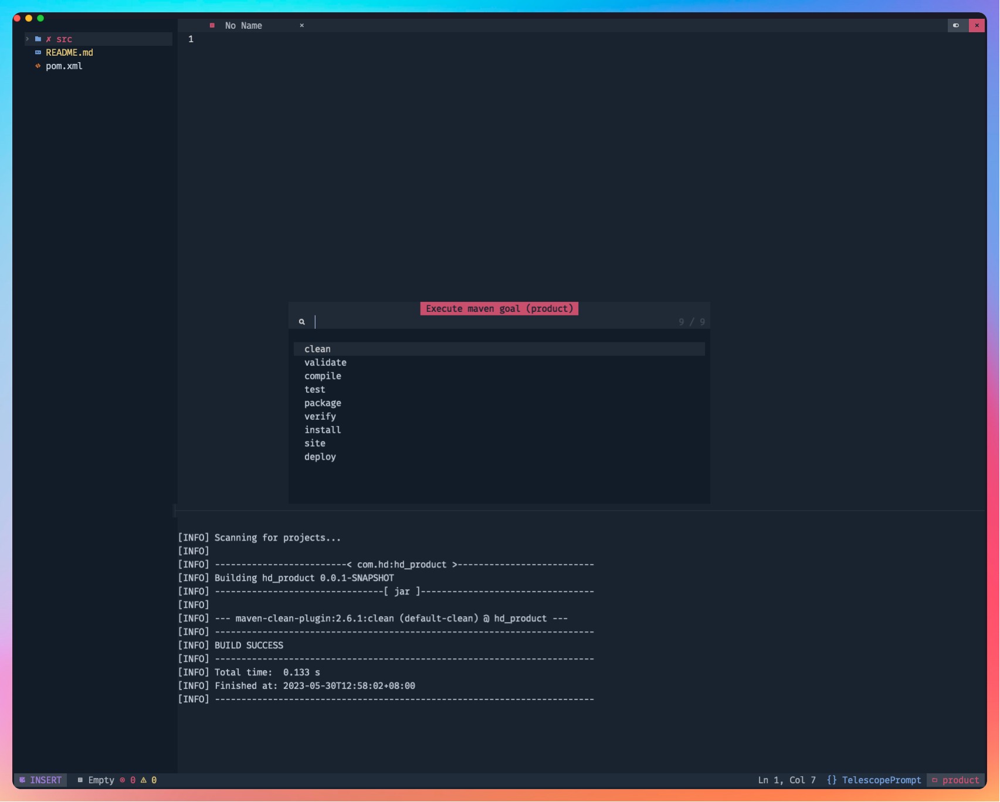

# Maven.nvim

This is a Neovim plugin to interactively execute Maven commands within the editor.



## Features

- [x] Run Maven goals (e.g. clean, compile, test, ...) within Neovim
- [x] Display logs of Maven commands execution
- [x] Customize Maven goals

## Installation

### Lazy

Install the plugin with your preferred package manager:

```lua
{
  "eatgrass/maven.nvim",
  cmd = "Maven",
  dependencies = "nvim-lua/plenary.nvim",
  config = function()
    require('maven').setup({
      executable="./mvnw"
    })
  end
},
```

### Configuration

```lua
require('maven').setup({
  executable = "./mvnw", -- `mvn` should be in your `PATH`, or the path to the maven exectable, for example `./mvnw`
  cwd = nil, -- work directory, default to `vim.fn.getcwd()`
  settings = nil, -- specify the settings file or use the default settings
  commands = { -- add custom goals to the command list
    { cmd = { "clean", "compile" }, desc = "clean then compile" },
  },
})
```

### Usage

#### Commands

`:Maven` choose maven command to execute

`:MavenExec` input maven command and run

#### Keys

`q` or `<ESC>` to close the maven log buffer
